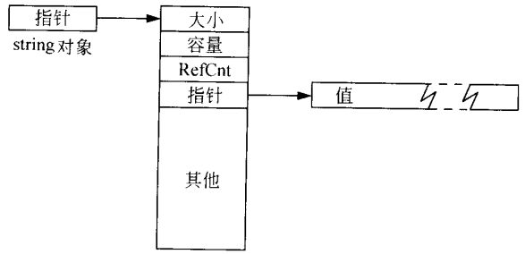
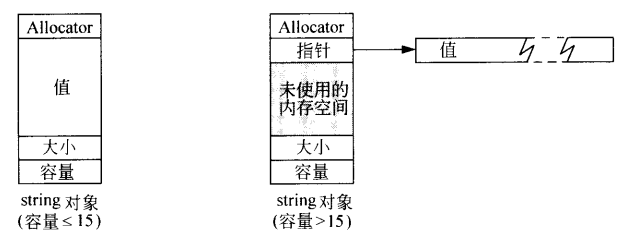
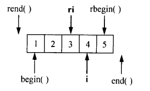
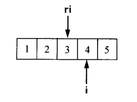
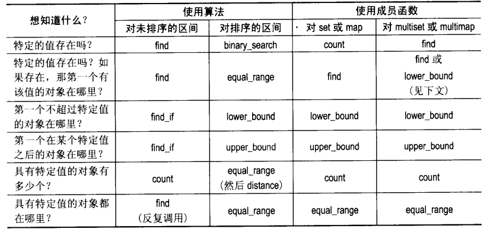

# Effective STL

  * [一.容器](#一容器)
     * [第1条：慎重选择容器类型](#第1条慎重选择容器类型)
     * [第2条：不要试图编写独立于容器类型的代码](#第2条不要试图编写独立于容器类型的代码)
     * [第3条：确保容器中的对象拷贝正确而高效](#第3条确保容器中的对象拷贝正确而高效)
     * [第4条：调用empty()而不是检查size()是否为0](#第4条调用empty而不是检查size是否为0)
     * [第5条：区间成员函数优先于与之对应的单元素成员函数](#第5条区间成员函数优先于与之对应的单元素成员函数)
     * [第6条：当心C  编译器最烦人的分析机制](#第6条当心c编译器最烦人的分析机制)
     * [第7条：如果容器中包含了通过new操作创建的指针，切记在容器对象析构前将指针delete掉](#第7条如果容器中包含了通过new操作创建的指针切记在容器对象析构前将指针delete掉)
     * [第8条：切勿创建包含auto_ptr的容器对象](#第8条切勿创建包含auto_ptr的容器对象)
     * [第9条：慎重选择删除元素的方法](#第9条慎重选择删除元素的方法)
     * [第10条：了解分配子（allocator）的约定和限制](#第10条了解分配子allocator的约定和限制)
     * [第11条：理解自定义分配子的合理用法](#第11条理解自定义分配子的合理用法)
     * [第12条：切勿对STL容器的线程安全性有不切实际的依赖](#第12条切勿对stl容器的线程安全性有不切实际的依赖)
  * [二.vector和string](#二vector和string)
     * [第13条：vector和string优先于动态分配的数组](#第13条vector和string优先于动态分配的数组)
     * [第14条：使用reserve来避免不必要的重新分配](#第14条使用reserve来避免不必要的重新分配)
     * [第15条：注意string实现的多样性](#第15条注意string实现的多样性)
     * [第16条：了解如何把vector和string数据传给旧的API](#第16条了解如何把vector和string数据传给旧的api)
     * [第17条：使用“swap技巧”除去多余的容量](#第17条使用swap技巧除去多余的容量)
     * [第18条：避免使用vector&lt;bool&gt;](#第18条避免使用vectorbool)
  * [三.关联容器](#三关联容器)
     * [第19条：理解相等和等价的区别](#第19条理解相等和等价的区别)
     * [第20条：为包含指针的关联容器指定比较类型](#第20条为包含指针的关联容器指定比较类型)
     * [第21条：总是让比较函数在等值情况下返回false](#第21条总是让比较函数在等值情况下返回false)
     * [第22条：切勿直接修改set或者multiset中的键](#第22条切勿直接修改set或者multiset中的键)
     * [第23条：考虑用排序的vector替代关联容器](#第23条考虑用排序的vector替代关联容器)
     * [第24条：当效率至关重要时，请在map::operator[]和map::insert之间谨慎选择](#第24条当效率至关重要时请在mapoperator和mapinsert之间谨慎选择)
     * [第25条：熟悉非标准的散列容器](#第25条熟悉非标准的散列容器)
  * [四.迭代器](#四迭代器)
     * [第26条：iterator优先于const_iterator、reserve_iterator及const_reserve_iterator](#第26条iterator优先于const_iteratorreserve_iterator及const_reserve_iterator)
     * [第27条：使用distance和advance将容器的const_iterator转换为iterator](#第27条使用distance和advance将容器的const_iterator转换为iterator)
     * [第28条：正确理解由reverse_iterator的base()成员函数所产生的iterator的用法](#第28条正确理解由reverse_iterator的base成员函数所产生的iterator的用法)
     * [第29条：对于逐个字符的输入请考虑使用istreambuf_iterator](#第29条对于逐个字符的输入请考虑使用istreambuf_iterator)
  * [五.算法](#五算法)
     * [第30条：确保目的区间足够大](#第30条确保目的区间足够大)
     * [第31条：了解各种与排序有关的选择](#第31条了解各种与排序有关的选择)
     * [第32条：如果确实需要删除元素，则需要在remove这一类算法之后调用erase](#第32条如果确实需要删除元素则需要在remove这一类算法之后调用erase)
     * [第33条：对包含指针的容器使用remove这一类算法时要特别小心](#第33条对包含指针的容器使用remove这一类算法时要特别小心)
     * [第34条：了解哪些算法要求使用排序的区间作为参数](#第34条了解哪些算法要求使用排序的区间作为参数)
     * [第35条：通过mismatch或lexicographical_compare实现简单的忽略大小写的字符串比较](#第35条通过mismatch或lexicographical_compare实现简单的忽略大小写的字符串比较)
     * [第36条：理解copy_if算法的正确实现](#第36条理解copy_if算法的正确实现)
     * [第37条：使用accumulate或者for_each进行区间统计](#第37条使用accumulate或者for_each进行区间统计)
  * [六.函数子、函数子类、函数及其他](#六函数子函数子类函数及其他)
     * [第38条：遵循按值传递的原则来设计函数子类](#第38条遵循按值传递的原则来设计函数子类)
     * [第39条：确保判别式是“纯函数”](#第39条确保判别式是纯函数)
     * [第40条：若一个类是函数子，则应使它可配接](#第40条若一个类是函数子则应使它可配接)
     * [第41条：理解ptr_fun、mem_fun和mem_fun_ref的来由](#第41条理解ptr_funmem_fun和mem_fun_ref的来由)
     * [第42条：确保less&lt;T&gt;与operator&lt;具有相同的含义](#第42条确保lesst与operator具有相同的含义)
  * [七.在程序中使用STL](#七在程序中使用stl)
     * [第43条：算法调用优先于手写的循环](#第43条算法调用优先于手写的循环)
     * [第44条：容器的成员函数优先于同名的算法](#第44条容器的成员函数优先于同名的算法)
     * [第45条：正确区分count、find、binary_search、lower_bound、upper_bound和equal_range](#第45条正确区分countfindbinary_searchlower_boundupper_bound和equal_range)
     * [第46条：考虑使用函数对象而不是函数作为STL算法的参数](#第46条考虑使用函数对象而不是函数作为stl算法的参数)
     * [第47条：避免产生直写型代码](#第47条避免产生直写型代码)
     * [第48条：总是包含（#include）正确的头文件](#第48条总是包含include正确的头文件)
     * [第49条：学会分析与STL相关的编译器诊断信息](#第49条学会分析与stl相关的编译器诊断信息)
     * [第50条：熟悉STL相关的Web站点](#第50条熟悉stl相关的web站点)

## 一.容器

### 第1条：慎重选择容器类型

C++提供了几种不同的容器供选择，他们之间各有差别，简单回顾一下：

- 标准STL序列容器：vector、string、deque、list。
- 标准STL关联容器：set、multiset、map、multimap。
- 非标准序列容器：slist（单向链表）、rope（"重型"string）。
- 非标准关联容器：hash_set、hash_multiset、hash_map、hash_multimap（均基于哈希表）。
- vector\<char\>作为string的替代：第13条中讲述了何种条件下这种替代的意义。
- vector作为标准关联容器的替代：第23条中阐述了，有时vector在运行时间和空间上都要优于标准关联容器。
- 几种标准的非STL容器：数组、bitset、valarray、stack、queue、priority_queue，第16条中提及了一种“数组优于STL容器”的情形；第18条中解释了bitset比vector\<bool\>要好；另外，数组也可被用于STL算法，这是因为指针可被用作数组的迭代器。

如上，可做出的选择是很多的，这意味着我们在做出选择的时候要考虑多种因素，C++标准对“如何在vector、deque和list中做出选择”提供的建议：

>vector、list和deque为程序员提供了不同的复杂性，使用时要对此做出权衡。vector是默认应使用的序列类型；当需要频繁地在序列中间做插入和删除操作时，应使用list；当大多数插入与删除操作发生在序列的头部和尾部时，deque是应考虑的数据结构。

以上建议如果是从算法复杂性考虑的话，是恰当的，但除此之外应考虑的还有很多。

STL有一种分类方法，这是对连续内存容器和基于节点的容器的区分：

* 连续内存容器：把它的元素存放在一块或多块（动态分配的）内存中，每块内存中存有多个元素，当有新元素插入或已有元素被删除时，同一内存块中的其他元素要向前或向后移动，为新元素让出空间，或者填充被删除的元素。这种移动影响到效率（参见第5条，第14条）和异常安全性。标准的连续内存容器有vector、string和deque，非标准的rope也是一个连续内存容器。
* 基于节点的容器：每一个（动态分配的）内存块中只存放一个元素。容器元素的插入或删除值只影响到指向节点的指针，而不影响节点本身的内容，所以当有插入或删除操作时，元素值不需要移动。表示链表的容器，如list和slist，是基于节点的；所有标准的关联容器也是如此（通常实现方式为平衡树）；非标准的哈希容器使用不同的基于节点的实现，第25条可看到这一点。

有了以上术语基础，以下是选择容器时应考虑的一些问题：

* **是否需要在容器的任意位置插入新元素？** 需要就选序列容器，关联容器不可行。
* **是否关心容器内元素是否排序？** 不关心可考虑哈希容器，否则避免哈希容器。
* **选择的容器必须是标准C++的一部分吗？** 如果是，请选择标准容器。
* **你需要哪种类型的迭代器？** 如果要求随机访问迭代器，请选择vector、deque、string之一。
* **发生元素的插入或删除时，是否关心容器内的元素是否移动？** 连续内存容器通常会移动容器内元素。
* **容器内数据布局是否需要与C兼容？** 如果需要兼容，只能选择vector（第16条）。
* **是否在意元素查找速度？** 如果是，依次考虑哈希容器（第25条）、排序的vector（第23条）、标准关联容器。
* **是否介意容器内部使用了引用计数技术？** 如果是，避免string，许多string的实现都使用了引用计数技术。如果你需要某种表示字符串的方法，可考虑vector\<char\>。
* **对插入与删除操作，你需要回滚能力吗？** 如果需要，请使用基于节点的容器。如果对多个元素的插入操作（即针对一个区间的形式，见第5条）需要回滚能力，请选择list，list提供了这种功能。对于希望编写异常安全代码的人，回滚能力是很重要的（使用连续内存的容器也可以获得这种能力，不过要付出性能上的代价，而且代码也显得不那么直截了当，更多细节请参考Sutter的Exceptional C++中的第17条）。
* **你需要使迭代器、指针和引用变为无效的次数最少吗？** 如果是，请使用基于节点的容器，这类容器的插入与删除从来不会使迭代器、指针、引用失效（除非你指向一个你正在删除的元素），而对于连续内存容器，插入和删除操作一般会使迭代器、指针、引用失效。
* **你介意在容器上使用swap，使得迭代器、指针和引用失效吗？** 如果介意，避免string，string是STL中唯一在swap过程中使得迭代器、指针和引用失效的容器。

以上并没有涵盖所有的情形，但你应该明白，在选择容器时，有很多要素要考虑，有在任何情况下都应该默认选择的容器吗？并没有。

### 第2条：不要试图编写独立于容器类型的代码

STL是以泛化原则为基础的：数组被泛化为“以其包含的对象类型为参数”的容器，函数被泛化为“以其使用的迭代器类型为参数”的算法，指针被泛化为“以其指向的对象为类型”的迭代器。

你看这泛化的不断进行，不禁也想进行一些泛化，比如对自己软件中所使用的容器进行泛化，想把容器的概念泛化：现在程序代码使用的是vector，以后改换成deque或list但并不用改变使用容器的代码。这类泛化，几乎总是错误的。

试图编写对于序列容器和关联容器都适用的代码几乎毫无意义，因为很多成员函数是对某一特定容器才存在的，而你若想编写通用代码，只能使用容器功能的交集，而至于这个交集是什么，种种限制与考虑过后，你的“泛化容器”将不能使用大部分操作，而剩余的操作也将耗费你不期望的时间，这不会是你想要的容器。

面对现实吧，不同容器就是不同的，他们有非常明显的优缺点，他们并不是被设计来交换使用的，而你又想稳，有一天我发现我曾经选择的容器不是最佳的容器，我该怎么办呢？

考虑有时候不可避免的要从某种容器类型转到另一种，一种常规的方式便是使用封装技术：

最简单的方式，使用typedef（c++11可使用using），所以，不要这样写：

~~~c++
class Widget{...};
vector<Widget> vw;
Widget bestWidget;
...               //对bestWidget赋值
vector<Widget>::iterator i =              //找到一个与bestWidget
    find(vw.begin(), vw.end(), bestWidget)//具有相同值的Widget
~~~

而应该这样写：

~~~c++
class Widget{...};
typedef vector<Widget> Widget_container;//使用类型别名
Widget_container vw;
Widget bestWidget;
...               //对bestWidget赋值
Widget_container::iterator i =
    find(vw.begin(), vw.end(), bestWidget)
~~~

不过，类型定义只是其他类型的别名，它带来的封装只是词法上的，无法阻挡客户做一些他们原本不能做到的事情，如果你不想把自己使用的容器暴露给客户，可以把容器隐藏到一个类里，尽量减少那些通过类接口（而使外部）可见的、与容器相关的信息。这样当你想改变使用的容器时，只需重写类相关成员函数的实现即可，客户代码则几乎不用变动。

### 第3条：确保容器中的对象拷贝正确而高效

容器中保存了对象，但并不是你提供给容器的那些对象，当向容器中添加对象时，存入容器的是你所指定的对象的拷贝（以下均不考虑C++11中的新特性“移动”）。而当对象被保存到容器中后，它经常会被进一步拷贝，比如：向vector、string、deque中插入或删除元素，现有元素的位置通常会被移动（复制），而使用排序算法、next_permutation或pre_permutation、remove、unique或类似操作、rotate或reverse等等算法，对象会被移动（拷贝），拷贝对象是STL的工作方式，而拷贝对象的方式则很简单，通常是利用一个对象的拷贝成员函数。

本条款的意图，是让你意识到，如果你向容器中填充对象，而对象的拷贝操作又很费时，那么这一简单的操作将会成为程序的性能瓶颈，而放入容器的对象越多，拷贝所需要的时间和空间就越多，而且，如果这些“拷贝”有特殊的含义，程序还将不可避免地出错。（其中一种情形参见第8条）。

另外，如果存在继承关系，拷贝动作将会导致剥离，也就是说，如果你创建一个保存基类对象的容器，却向其中插入派生类的对象，那么派生类对象在被拷贝进容器时，他所特有的非基类部分的信息将会丢失，这样做几乎总是错误的：

~~~c++
vector<Widget> vw;
class SpecialWidget:    //SpecialWidget继承自Widget
    public Widget{...};
SpecialWidget sw;
vw.push_back(sw);       //sw作为基类对象被拷贝进vw中
                        //它所特有的派生类部分在拷贝时被丢掉了
~~~

使拷贝动作高效，正确，并且防止剥离的一种简单方法是使容器包含指针而不是对象本身，不过，指针本身也有一些令人头疼的、与STL相关的问题，参考第7条和第33条。而要想避免刚才的问题，智能指针是一个诱人的选择，不过，智能指针也存在一些问题（参考第8条）。

以上的讲述，可能会让人觉得STL是在疯狂地拷贝，那让我们最后来想一想这个问题：没错，STL是做了很多拷贝，但它的总设计思想是为了避免不必要的拷贝，而事实上，它的设计目的是为了避免创建不必要的对象，把它和数组做一下比较：

~~~c++
Widget w[maxNumWidgets];//创建了有maxNumWidgets个Widget的数组
                        //每个对象都使用默认构造函数创建
~~~

这将创建maxNumWidgets个Widget对象，无论你是否使用它们；而使用vector，则容器则会在它需要时才会增长，与内置数组相比，STL容器要聪明得多，STL是在创建拷贝，不过，比起数组而言，它还是迈出了一大步的。

### 第4条：调用empty()而不是检查size()是否为0

对任意容器而言，下面的代码：

~~~c++
if(c.size() == 0);
~~~

语义上与

~~~c++
if(c.empty());
~~~

是等价的，不过，这两种形式是有差别的，差别是：empty对所有的标准容器都是常数时间，而对一些list实现，size耗费线性时间。为什么？

 原因在于list所独有的链接（splice）操作，当对list进行链接后，原list中的元素数目是它链接前元素数目加上链接过来的元素数目，但如何知道链接过来的元素究竟有多少个呢？你可能会想，既然用户想知道list中有多少元素，你想设计list，使size花费常数时间，但同时，你知道在所有的标准容器中，只有list具有把元素从一处链接到另一处而不需要拷贝任何数据的能力，很多人选择list的原因就是它提供了高效的链接操作，他们希望从一个区间从一个list链接到另一个list花费常数时间，这样，你想满足他们，使splice操作花费常数时间。

 那么，问题来了，如果size花费常数时间，那么每个list成员函数操作就必须更新它们操作的链表的大小，当然包括splice，这样，splice就必须遍历区间，不再花费常数时间，而如果你想让splice花费常数时间，size就必须花费线性时间计算大小，他们两个，只有一个可以成为常数时间操作。

 不同的list实现通过不同的方式解决上述冲突，这取决于作者。而调用empty()，总会花费常数时间。

### 第5条：区间成员函数优先于与之对应的单元素成员函数

优先选择区间成员函数而不是其对应的单元素成员函数有三条充分的理由：

* 区间成员函数写起来更容易
* 更容易表达你的意图，可读性更好
* 效率更高，这表现在很多方面

首先，写下列代码：

~~~c++
v1.assign(v2.begin() + v2.size() / 2, v2.end());
~~~

肯定比写下列代码可读性要好：

~~~C++
v1.clear();
for(vector<Widget>::cnst_iterator ci = v2.begin() + v2.size() / 2;
    ci != v2.end(); ++ci)
    v1.push_back(*ci);
~~~

另外，第一种方式仅调用了一次assign，而第二种方式调用了（v2.size() / 2）次push_back, 也许assign内部也是和第二种方式类似，也许它直接把这一大块数据进行赋值，不管怎样，在这里区间成员函数总比单元素成员函数要好。

而且，从内存分配方面考虑，考虑到向vector中添加元素时，如果vector内存已满，那么vector通常会扩充他的容量（假设是加倍），那么，第二种方式，vector每次都只添加一个元素，vector并不知道自己最后总共要添加多少个元素，vector应该会进行log（v2.size() / 2）次容量扩充，而第一种方式，vector在添加元素前便已经知道自己需要多少元素，因此不必多次扩充容量，这一节省的时间是很可观的。

不只是对vector，对于string，deque，list使用区间成员函数也可以避免不必要的时间开销，从而获得高效率。

### 第6条：当心C++编译器最烦人的分析机制

假设你有一个存有int的文件，你想把这些int复制到一个list中，下面是很“合理”的一种做法：

~~~c++
ifstream data_file("ints.dat");
list<int> data(istream_iterator<int>(data_file),
               istream_iterator<int>());
~~~

这段代码可以通过编译，但是在运行时，它什么也不会做，为什么？

先从最基本的说起，现在，声明一个带double参数返回int的函数：
~~~c++
int f(double d);
~~~
下面代码做了同样的事，d两边的括号是多余的：
~~~c++
int f(double (d)); //d两边的括号会被忽略
~~~
下面代码也做了同样的事，只是省略了参数名称：
~~~c++
int f(double);     //参数名称被忽略
~~~

以上三种形式的声明你应该很熟悉，再来看三个声明：
~~~c++
int g(double (*pf)());  //g的参数是一个函数（无参数，返回double）指针
~~~
这样写和上面的意思一致：
~~~c++
int g(double pf());     //pf为隐式指针
~~~
同样，你也可以省略参数名称：
~~~c++
int g(double ());     //省略参数名称
~~~

注意围绕参数名的括号和独立括号的区别，围绕参数名的括号被忽略，独立括号意味着参数列表的存在：存在一个函数指针参数。

现在我们来看开始的问题：

~~~c++
ifstream data_file("ints.dat");
list<int> data(istream_iterator<int>(data_file),
               istream_iterator<int>());
~~~

这里**声明**了一个函数，data，它的返回值是list\<int\>，这个data函数有两个参数：

* 第一个参数名称为data_file，它的类型为istream_iterator\<int\>，data_file两边的括号是多余的，被忽略。
* 第二个参数没有名称，它的类型是一个函数指针，指向一个没有参数，返回istream_iterator\<int\>的函数。

这很令人吃惊！但它与C++中的一条规律相符，即尽可能的解释为函数声明，举个例子，如果你写C++有一段时间了，你肯定遇到过下面错误：

~~~c++
class Widget{...};//假设Widget有默认构造函数
Widget w();       //想显式调用默认构造函数？
~~~

这可没有声明一个名为w的Widget，而是声明了一个名为w的函数。

通过增加一对括号，强迫编译器按照我们想要的方式工作：
~~~c++
ifstream data_file("ints.dat");
list<int> data((istream_iterator<int>(data_file)),
               istream_iterator<int>());
~~~
这是声明data的正确方式，此外，还有一种办法，那就是避免在data声明中使用匿名的istream_iterator对象：
~~~c++
ifstream data_file("ints.dat");
istream_iterator data_begin(data_file);
istream_iterator data_end;
list<int> data(data_begin,data_end);
~~~
虽然使用命名的迭代器对象与通常的STL风格相违背，不过以上方式可避免使代码有二义性，并且使维护代码的人理解起来更容易。

### 第7条：如果容器中包含了通过new操作创建的指针，切记在容器对象析构前将指针delete掉

STL中的容器，会自己进行适当的内存管理，当他们被析构时，他们会自动析构所包含的每个对象，不要以为这样你就无需考虑清理问题，如果容器包含的是通过new方式而分配的指针，容器的确会析构掉它包含的每个指针，但并不会调用delete，这会导致内存泄漏。

你可以选择在容器还没析构时，自己手动调用delete来解决这个问题，但这并不是异常安全的。假如你在删除指针过程中抛出了异常，剩下的指针就不会被delete，同样会发生资源泄漏，怎么办呢？最简单的方法就是使用智能指针，不过，千万不要使用auto_ptr！（参见第8条），此外，你也可以选择使用RAII（智能指针实际上就是RAII的一个例子）。

### 第8条：切勿创建包含auto_ptr的容器对象

首先明确一点，auto_ptr的容器是被禁止的，按照标准，试图违反这一条规定的代码不会通过编译。那么，为什么呢？

回顾一下之前所说的，容器会做很多拷贝操作，拷贝auto_ptr意味着什么？当你拷贝一个auto_ptr时，它所指的对象的所有权会被移交给复制的auto_ptr上，而它自身被置为NULL：拷贝一个auto_ptr意味着改变它的值！

这一现象会导致程序出现各种各样奇怪的问题，比如说：

~~~c++
vector<auto_ptr<int> > v;   //这不应该通过编译
...
sort(v.begin(), v.end(),    //对vector排序
{ return *l > *r ;});//lambda
~~~

这段代码看起来没什么问题，但实际上呢？在排序的过程中，v中的一个或者多个auto_ptr可能会被置为NULL，对v的排序竟然改变了v的内容！

如果你想使用包含智能指针的容器，别害怕，这是没有问题的，有问题的是auto_ptr不是应该放在容器中使用的智能指针。

### 第9条：慎重选择删除元素的方法

假定你有一个下面的容器：

~~~c++
Container<int> c;
~~~

如果你想删除c中所有值为2017的元素，完成这一任务的方式是随着容器类型而异的：

* 如果容器是连续内存容器（vector、deque、string），最好的办法是采用erase-remove习惯用法（见第32条）：
    ~~~c++
    c.erase(remove(c.begin(), c.end(), 2017), c.end());
    ~~~

* 如果是list，erase-remove方法同样有效，不过推荐使用成员函数remove：
    ~~~c++
    c.remove(2017);
    ~~~

* 如果容器是标准关联容器（set、multimap，map，multimap），对这些容器使用remove算法，可能会覆盖容器的值并破坏容器（见第22条），而这类容器根本没有remove成员函数，所以请调用erase成员函数：
    ~~~c++
    c.erase(2017);
    ~~~

现在改变一下需求，我们要删除c中满足下面判别式的每一个对象：

~~~c++
bool q(int );
~~~

* 对于序列容器（vector，string，deque，list），把remove调用换成remove_if就可以了：
    ~~~c++
    c.erase(remove_if(c.begin(), c.end(), q),//当c是vector、string、
            c.end());                        //deque时，这是最佳办法

    c.remove_if(q);                          //当c是list的最佳办法
    ~~~

* 对于关联容器，有两种办法，一种利于编码，另一种效率更高：
    * 易于编码的方法，利用remove_copy_if把我们需要的值复制到另一个新容器中，再把原来容器中的内容与新容器中的内容交换：
    ~~~c++
    AssocContainer<int> c;      //c是一个关联容器
    ...
    AssocContainer<int> good_c; //存放需要的值
    remove_copy_if(c.begin(), c.end(),
                    inserter(good_c, good_c.end()),
                   q);
    c.swap(good_c);
    ~~~
    * 效率更高的方法，写一个循环遍历并删除要删除的元素：
    ~~~c++
    AssocContainer<int> c;
    ...
    for(AssocContainer<int>::iterator i = c.begin();
        i != c.end(); ++i)
        //注意，下面这里必须要写i++，因为当关联容器中的一个元素
        //被删除时，指向该元素的所有迭代器都会失效，必须先递增
        //迭代器，再返回指向该删除的那个元素的迭代器
        if(q(*i))   c.erase(i++);
        else        ++i;
    ~~~

现在再改一下需求，我们在上面的基础上，希望每次元素删除时，都能向一个日志文件中写一条信息：

* 对于关联容器，这十分简单，只需要对循环简单修改：
    ~~~c++
    ofstream logfile;
    AssocContainer<int> c;
    ...
    for(AssocContainer<int>::iterator i = c.begin();
        i != c.end(); ++i){
        if(q(*i)){
            logfile << "Erase" << *i << '\n'; //写日志文件
            c.erase(i++);                     //删除元素
        }
        else        ++i;
    }
    ~~~

*  对于vector、string、deque，我们无法使用erase-remove方法了，这个方法无法写日志文件。而且我们不能用和关联容器一样的方法，因为调用erase后，指向被删除元素自身以及它之后所有元素的迭代器都会失效！我们要利用erase函数的返回值，它会返回紧跟被删除元素的下一个元素的有效迭代器：
    ~~~c++
    for(SeqContainer<int>::iterator i = c.begin();
        i != c.end(); ++i)
        if(q(*i)){
            logfile << "Erase" << *i << '\n';
            i = c.erase(i);       //把erase返回值赋给i，使i的值有效
        }
        else        ++i;
    ~~~

* 对于list，就遍历和删除来说，你可以把它当作vector/string/deque对待，也可以把它当作关联容器对待，两种方式对list都适用，通常是把list看作vector/string/deque对待。

总结一下：

* 要删除容器中有特定值的所有对象：
    * 如果容器是vecotr/string/deque，则使用erase-remove方法。
    * 如果容器是list，使用list::remove。
    * 如果容器是标准关联容器，使用它的而erase成员函数。
* 要删除容器中满足特定判别式的所有对象：
    * 如果容器是vecotr/string/deque，则使用erase-remove_if方法。
    * 如果容器是list，使用list::remove_if。
    * 如果容器是标准关联容器，使用remove_copy_if和swap，或者写一个循环遍历容器中的元素，注意把迭代器传给erase时，对它进行后缀递增。
* 要在循环内部做某些（除了删除对象之外）操作：
    * 如果容器是标准序列容器，写一个循环遍历元素，注意每次调用erase时，用它的返回值更新迭代器。
    * 如果容器是标准关联容器，写一个循环遍历元素，注意把迭代器传给erase时，对它进行后缀递增。

### 第10条：了解分配子（allocator）的约定和限制

分配子很奇怪，它的最初设计意图是提供一个内存模型的抽象，像new操作符和new[]操作符一样，STL内存非配置负责分配（释放）原始内存，但它提供的接口和new操作符，new[]操作符甚至malloc一点也不相似，而且，很多标准容器从来不向与之关联的分配子申请内存，从来没有，这使分配子变得很怪异。

C++标准中，一个类型为T的对象，它的默认分配子（allocator\<T\>）提供了两个类型定义，allocator\<T\>::pointer, allocator\<T\>::reference，用户定义的分配子也应该提供这些类型定义。

这里有些问题，对吗？C++中，引用是不可能仿冒的，因为这需要重载operator.（点操作符），可这个操作符是不允许重载的，并且，创建这种具有引用特点的对象是使用代理对象的一个例子，而使用代理对象会有很多问题（详见More Effective C++ 第30条）。

C++标准明确指出，允许库实现者假定每个分配子的指针类型等同于T*，而引用类型等同于T&，也就是说，库实现者可以忽略类型定义，直接使用指针和引用。

这很怪异，对吧？再来一个，分配子是对象，意味着它可以有成员函数，嵌套类型和类型定义，而C++标准说，STL的实现可以假定所有属于同一类型的分配子对象都是等价的，并且相互比较的结果总是相等的，很糟糕？这还是有理由的：

~~~C++
template<typename T>
class SpecialAllocator{...};
typedef SpecialAllocator<Widget> SAW;
list<Widget,SAW> list1;
list<Widget,SAW> list2;
...
list1.splice(list1.begin(),list2);//把list2的节点移动到list1的前面
~~~

想一下，当list中的元素被链接到另一个时，没有复制任何东西，只有一些指针值被调整，那么，当list1被析构时，它必须释放自己所有的节点（包括从list2链接过来的节点），因为假定同一类型的分配子是等价的，所以由list2分配子对象分配的内存就可以由list1分配子对象安全的释放。

但是再想一想，假定同一类型的分配子是等价的其实是一个很严苛的限制，它意味着可移植的（在不同的STL实现下都可以正确工作）分配子不可以有状态，也就是任何**非静态的成员**，至少不能有影响其行为的数据成员，因为这样，两个分配子对象就有可能不再等价了。

再来讨论下分配子分配原始内存这点，它的接口与new操作符是不同的，看看他们的声明，如下：

~~~c++
void* operator new(size_t butes);
//pointer是个类型定义，它实际上总是T*
pointer allocator<T>::allocate(size_type numObjects);
~~~

两者都带参数指定要分配多少内存，对于operator new，指明的是一定数量的字节，而对于allocate，指明的是内存中要容纳多少个T对象。

它们的返回值也不同，operator new返回void\*，指向未初始化内存，而allocator\<T\>::allocate返回T\*，可是，此时T尚未构造！STL有着这样的期望：allocator\<T\>::allocate的调用者最终会在返回的内存中构造一个或者多个T对象（可能通过allocator\<T\>::construct，或者通过uninitialized_fill，或者通过raw_storage_iterator的某些应用），但是在vector::reserve，string::reserve的情况下，这种构造可能根本没有发生过（见第14条）。

这样，来看一下分配子最后一个奇怪的地方，即大多数标准容器从来没有单独调用过对应的分配子，举个例子：

~~~c++
list<int> L;
set<Widget, SAW> s;
~~~

这一现象对于list和所有的标准关联容器都存在（set、multiset、map、multimap），这是因为它们是基于节点的容器，也就是说每当新节点插入容器中时，节点是被动态分配的。

考虑一下list\<T\>的一个可能实现：

~~~c++
template<typename T,
         typename Allocator = allocator<T> >
class list{
private:
    Allocator alloc;
    struct Listnode{
        T data;
        Listnode *pre;
        Listnode *next;
    };
    ...
};
~~~

当新的元素被插入到容器时，我们需要通过分配子获得内存，但我们并不需要T的内存，我们需要的是Listnode的内存，这让我们的Allocator对象毫无用处。不过，分配子按照约定解决了这个问题，它定义了一个类型other，这个类型能从已有的分配子类型向与Listnode类型相适应的分配子过渡，可能说的有点绕，直接看它的实现：

~~~c++
template<typename T>
class allocator{
public:
    template<typename U>
    struct rebind{
        typedef allocator<U> other;
    };
    ...
};
~~~

像上面这么写过的话，Listnode的分配子的类型为：
~~~C++
Allocator::rebind<Listnode>::other
~~~

如果你想自己自己写一个自定义的分配子，并想让它同标准容器一起工作，那么你的分配子必须提供rebind模版。

总结一下：
* 你的分配子是一个模版，模版参数T代表你为它分配内存的对象的类型。
* 提供类型定义pointer和reference，并始终让pointer为T*，reference为T&。
* 不要让你的分配子拥有随对象不同的状态，通常分配子不应该有非静态的数据成员。
* 传给分配子的allocate成员函数的是你要求内存的对象的个数，并且函数返回T*指针，即使尚未有T对象被构造出来。
* 一定要提供嵌套的rebind模版。

### 第11条：理解自定义分配子的合理用法

有时，你觉得STL默认的allocator太慢，或者浪费内存，想写自己的分配子，自定义的分配子可以把STL容器放在你建立的共享内存中，或者放在一个特殊堆中的相邻位置，自定义分配子在很多场合下都很有用，只要你遵守分配子的种种限制。

### 第12条：切勿对STL容器的线程安全性有不切实际的依赖

在线程方面，你对STL的实现只能期望：
* 多个线程读是安全的。
* 多个线程对不同的容器做写入操作是安全的。

写多线程的代码是不容易的，你可能希望STL实现能提供完全的线程安全性，但，这很困难，考虑一下实现一个库实现线程安全性可能采用的方式：
* 对容器成员函数的每次调用，都锁住容器直到调用结束。
* 在容器所返回的每个迭代器的生存期结束前，都锁住容器。
* 对于作用于容器的每个算法，都锁住该容器，直到算法结束。

STL要想实现以上的要求，并根据你的代码自动提供线程安全性，并且不对程序造成显著的效率影响，非常非常难，你应该手动控制线程安全，比如采用RAII（resource acquisition is initialization）。

## 二.vector和string

### 第13条：vector和string优先于动态分配的数组

如果你决定用new动态分配内存，意味着：
* 你必须确保之后的代码中用delete删除所分配的内存。
* 你必须确保使用了正群的delete形式，delete或delete[]。
* 你必须确保只delete了一次。

忘记了以上任何一条就很有可能导致你的程序无法正常工作或发生内存泄漏，但使用vector和string，你便不用考虑这些事情。

同时，vector和string是标准的STL序列容器，它们有很多操作，也可以应用适合于序列容器的STL算法（虽然数组也可以，但毕竟数组自己无法提供begin()，end()等操作），如果你想支持老版本的代码，vector和string也可以很方便的把数据传给旧的API。

另外，某些string实现在背后采用了引用计数技术，这种技术可以消除不必要的内存分配和不必要的字符拷贝，可以提高应用程序的效率，不过，在多线程环境下使用采用引用计数的sting时，你在背后同步控制的时间可能比引用计数节省的时间还多，即引用计数技术反而影响了你的效率。这种情况下，你可以：
* 检查库实现，看是否可以禁止引用计数。
* 换用另一个没采用引用计数的string。
* 用vector\<char\>代替string。

### 第14条：使用reserve来避免不必要的重新分配

STL容器很好的一点是，它会自动增长以便容纳下你放入其中的数据，只要没超过它的最大限制（调用max_size()获取最大限制），对于vector和string，每当需要增长时，它调用和realloc类似的操作：
1. 分配一块大小为当前容量某个倍数的新内存，通常为2倍（？）。
1. 把容器中所有元素从旧内存复制到新内存中。
1. 析构旧内存中的对象。
1. 释放旧内存。

考虑上述过程，我们可以知道，整个过程会很耗时，并且，每当上述过程发生，vector和string的所有指针、迭代器和引用都会失效，呀，这可不好。

reserve成员函数可以让你把重新分配内存的次数减少到最低限度，从而减小了开销，解释该怎么使用reserve前，回忆一下容易混淆的函数，注意只有vector和string提供了下面全部四个函数：
* size()：容器中现在有多少个元素。
* capacity()；容器利用当前已分配的内存可以容纳多少元素，注意，这是容器能容纳的元素总数，不是它还能容纳多少元素，如果想得知剩余空间，请用capacity()-size()。
* resize(Container::size_type n)：强迫容器改变到包含n个元素的状态，即调用resize(n)后，size()返回n。如果n比size()小，则析构容器尾部的元素；如果n比size()大，则通过默认构造函数将创建的新元素添加到容器的末尾；如果n比capacity()大，则在添加元素前先重新分配内存。
* reserve(Container::size_type n)：强迫容器把它的容量变为至少为n（n应不小于当前容量），通常，这会导致重新分配，因为容量会增加。如果n比容量小，vector会什么也不做，string可能会把自己的容量减为size()和n中的最大值，但是string的大小肯定不变，如果你想利用这个特性用reserve除去string多余的容量，不如使用“swap技巧”（见第17条）。

只有当容器容量不够时，才会重新分配，为了避免重新分配，你有两种方式：

1. 如果确切知道或大致预计容器最终会有多少元素，在开始就用reserve预留适当大小的空间即可。
1. 先预留足够大的空间，然后把所有数据加入后，再去除多余的容量，去除多余部分并不困难（见第17条）。

### 第15条：注意string实现的多样性

实现string的方式很多，string对象的大小也未必相同，不过，几乎每个string实现都包含如下信息：

* 字符串的大小(size)，即它所包含的字符的个数。
* 用于存储该字符串中字符内存的容量。
* 字符串的值，即构成该字符串的字符。

一个string可能包含：
* 它的分配子的一份拷贝。

建立在引用计数基础上的string实现可能包含：

* 对值的引用计数。

不同的string用不同方式组织上述信息，举4个例子：

A. 每个string对象包含其分配子的一个拷贝、该字符串的大小、它的容量、一个指向一块动态分配内存的指针，这块内存中包含了引用计数和字符串值。使用默认分配子的string对象大小是一个指针的4倍，使用自定义分配子则取决于自定义分配子的大小：

B. 每个string对象包含一个指向一个结构的指针，由于用了优化，使用默认分配子不需要多余空间。结构中包含字符串的大小，容量和引用计数，一个指向动态分配内存（存放着字符串的值）的指针，还有一些与多线程环境下同步控制相关的额外数据（Other）。每个string对象的大小与指针大小相同：

C. 每个string对象中包含一个指针，这个指针指向一块包含所有与字符串相关的数据（大小，容量，引用计数，值）的动态内存。没有对单个对象的分配子支持，还包含了一些与值的可共享性有关的数据（X），每个string对象的大小总与指针相同：

D. 每个string对象中包含一块内存，最多可容纳15个字符的字符串，而当string的容量超过15时，该内存的起始部分被当作一个指向动态分配内存的指针，这称为“小字符串优化”，该实现不使用引用计数。每个string对象的大小是指针的7倍：

通过上面的4个例子，你应该考虑在不同情况下应选择哪种string实现，不同的实现有很多区别，总结：

* string的值是否被引用计数。
* string对象大小的范围可以为一个char*指针大小的1~7倍。
* 创建一个新的字符串值可能需要0，1或2次动态分配内存。
* string对象可能共享，有可能不共享大小和容量信息。
* string不一定支持针对单个对象的分配子。
* 不同实现对字符内存的最小分配单元要求不同。

### 第16条：了解如何把vector和string数据传给旧的API

对于vector，因为vector保证和数组有同样的内存布局，你可以直接把vector中的数据当作数组中的数据对待，那么只需使用&v[0]即可，不过注意v不能是空的，为了避免错误，你可以这样写：

~~~c++
if(!v.empty()){
    c_api(&v[0],v.size());
}
~~~

对于string，上面的方式不可行，因为string中的数据不一定存储在连续的内存中，且string的内部表示不一定是以空字符结尾的。你可以调用c_str()成员函数。

由于传给API的都是指针，所以理论上是可以改变原数据的，不过，对于string来说，API不应更改它的数据，因为c_str产生的指针未必指向字符串数据的内部表示，也可能指向字符串数据的一个不可修改的拷贝。

而对于vector来说，API更改元素值通常没什么问题，但不要试图改变元素的个数，这会使vector无法得知自己的正确大小从而发生错误。

别忘了，vector保证和数组有同样的内存布局，所以如果想把vector和string之外的STL容器中的数据传递给C API，你可以把每个元素都拷贝到一个vector中再把这个vector中的数据传递给C API。

### 第17条：使用“swap技巧”除去多余的容量

如果你向一个vector中添加了10000个元素，然后删除其中的9990个元素，这时vector中还剩10个元素，虽然容器的size减小了，可它的capacity并没有减小，怎样把多余的capacity除去呢？可以像下面这么写：

~~~c++
//表达式vector<int>(data)创建一个临时vector，它是data的拷贝，
//由拷贝构造函数完成，只为拷贝的元素分配内存，除去了多余的capacity，
//然后调用swap交换临时vector和原vector的内容
vector<int>(data).swap(data);
~~~

以上称之为shrink to fit，不过在拷贝时，STL实现可以为容器保留多余的容量（比如容量为2的乘幂数），因而这不一定能把所有的多余空间都除去。

类似，以下代码可以清空容器：
~~~c++
vector<int>().swap(data);
~~~

顺带一提，swap操作不会使迭代器、指针和引用失效，它们依然指向原来的元素，只是元素的位置已经变了。

PS：C++11已为deque、string、vector提供了shrink_to_fit成员函数，功能与本节一致，不过能否将capacity()减少到size()仍然依赖实现，并可能发生重分配。

### 第18条：避免使用vector\<bool\>

首先明确，vector\<bool\>不是一个STL容器，其次它也不存储bool，其他一切正常。

为什么说vector\<bool\>不是一个STL容器？因为下面的代码无法通过编译：

~~~c++
vector<bool> c(50);
bool* p = &c[0];//无法通过编译
~~~

Why？因为vector\<bool\>为了节省空间，它并不真的存储bool，而 是类似位域的思想，存储在vector\<bool\>中的每一个“bool”仅占一个二进制位，一个8位的字节可容纳8个“bool”。创建指向一个bool的指针是被允许的，但创建指向单个位的指针是不允许的。

指向单个位的引用也是被禁止的，那么，vector\<bool\>怎么解决operator[]应该返回T&的问题？它采用了代理对象的概念，也就是说，vector\<bool\>::operator[]实际上返回一个对象，这个对象表现得像一个指向单个位的引用，大概像下面这样：

~~~c++
//模版偏特化
template<typename Allocator>
vector<bool, Allocator>{
public:
    class reference {...};//代理对象类
    reference operator[]*(size_type n);
    ...
};
~~~

那么，下面代码为何不能通过编译就好理解了：

~~~c++
vector<bool> c(50);
bool* p = &c[0];//右侧类型实际上是vector<bool>::reference*
~~~

既然vector\<bool\>不是一个STL容器，它为何还出现在C++标准中呢？原因是因为一个雄心勃勃的实验：

    代理对象在C++软件开发中经常会很有用，而C++标准委员会的人很清楚这一点，于是他们决定开发vector<bool>来演示STL如何支持“通过代理来存取其元素的容器”，他们认为，C++标准中有了这个例子，人们就在实现自己的基于代理的容器时就有了现成的参考。然而，他们却发现，要创建一个基于代理的容器，又要求它满足STL容器的所有要求是不可能的，由于种种原因，这个失败的尝试遗留在了标准中:(

所以，最好不要使用vector\<bool\>，如果你想要一个bool的容器，你可以选择deque\<bool\>，如果你想对位进行操作，可以选择bitset。

## 三.关联容器

### 第19条：理解相等和等价的区别

STL中比较操作随处可见，代表性的是find算法和set::insert，不过这两个对“相同”的定义不同：

* find对相同的定义为“相等”，基于operator==。
* set::insert对相同的定义为“等价”，基于operator\<。

相等的概念很明确，就是 x==y 。

而等价的概念为，!(x\<y) && !(y\<x)，通常等价关系是以“在已排序的区间中对象的相对顺序”为基础的，想想关联容器的排列关系，这很有用：两个同类型对象x和y，仅根据对象中一种数据进行排序（比如对年龄而不对身高排序），那么，x与y等价可不意味着x与y相等。

再举个例子，假设考虑一个不区分大小写的set\<string\>，则当你这样做时：

~~~c++
set<string,cistring> s;\\cistring为不区分大小写的比较类
s.insert("hello");//一个新元素被插入s
s.insert("HElLo");//没有新元素被插入s，HElLo与hello等价
...
//调用set::find：
s.find("hEllO") != s.end()；//查找会成功，这个表达式为真
//调用find算法：
find(s.begin(), s.end(), "hEllO") != s.end();//查找失败，表达式为假
~~~

上面的现象说明了：set等标准关联容器基于“等价”，而find算法基于“相等”。

为什么标准关联容器要基于等价呢？如果它基于相等，由于标准关联容器总是保持顺序的，那么它就需要两个函数：比较函数确定顺序，相等函数判定相等。然后遇到这种情况：两个年龄相等而身高不同的对象，相等函数判定肯定是不相等，所以它们两个都可以插入容器，而比较函数按照年龄排序，由于年龄相等，无法判断顺序，它们究竟谁在前谁在后？（事实上，multiset和multimap就是这样的，等价的值是无法确定顺序的，所以你无法以确定的顺序遍历这种容器）而“等价”则可以避免“相等”带来的一堆问题。

另外，对于非标准的非排序性关联容器（hash_map等），等价和相等都有可能被使用。

### 第20条：为包含指针的关联容器指定比较类型

如果你这样写：
~~~c++
set<string*> s;
s.insert(new string("Aaa"));
s.insert(new string("Ccc"));
s.insert(new string("Bbb"));
s.insert(new string("Ggg"));
for(auto i = s.begin(); i != s.end(); ++i){
    cout << *i << endl;
}
~~~
你觉得结果会是什么？结果是一堆十六进制数——那是指针的值，别忘了，set里存的是指针。

而如果把*i换成**i，结果也未必是你想要的，因为此时set中的比较函数是less\<string\*\>，你觉得less\<string\*\>是怎样比较指针？对指针解引用然后比较string？不，它只是简单地对指针的值进行比较:(

为了让s中的元素正确排序，请提供自定义比较类型，像这样：

~~~c++
struct string_cmp:
    //继承此基类的原因请查看第40条
    pubilc binary_function<const string*,
                           const string*,
                           bool>{
    bool operator()(const string* l, const sting* r){
        return *l<*r;
    }
}

set<string*, string_cmp> s;
...
~~~

注意，请提供一个**比较类型**，不要妄想这样做：
~~~c++
bool cmp(const string* l, const sting* r){
        return *l<*r;
}
...
set<string*, cmp> s;
...
~~~

上面的代码不会通过编译，cmp只是一个函数名，而提供给set模版的必须是一个类型名，set需要一个**比较类型**，并创建一个该比较类型的函数（对象）。

另外，尽管本条针对的是指针，但实际上，对于包含对象和指针行为类似（如智能指针、迭代器）的关联容器也适用。

### 第21条：总是让比较函数在等值情况下返回false

出个小问题，看下面：

~~~C++
set<int, less_equal<int>> s;
s.insert(10);
s.insert(10);
~~~

问：10插入了几次？答：2次。

别忘了，标准关联容器是基于等价的，也就是：
~~~C++
!(x<y) && !(y<x)
~~~
那么在上面的问题中，实际上进行的是下面的判断：
~~~C++
!(10<=10) && !(10<=10) //结果为false
~~~
也就是说，10和10不等价！所以请把比较函数定义为\<而不是\<=，即让比较函数在等值情况下返回false。

嘿！multimap和multiset允许添加重复元素，上面的问题对于multiset，multimap不存在的吧？

不不不，还是存在的，假设你一开始这样写：
~~~C++
multiset<int, less_equal<int>> s;
s.insert(10);
s.insert(10);
~~~

当你对s调用equal_range，你期望得到一对迭代器，这个迭代器区间一定只包含这两个10，但问题是，equal_range得到的区间里的值一定都是等价的，所以你得不到你期望的迭代器区间。

从技术来说，用于对关联容器排序的比较函数必须为它们所比较的元素定义一个“严格弱序”（传给sort之类的算法的比较函数也有这个要求），严格弱序意味着什么？不要管太多细节，只记住一点，任何一个定义了“严格弱序”的函数对于两个相同的值比较都返回false，这正是本条所告诉你的。

### 第22条：切勿直接修改set或者multiset中的键

因为set和multiset中的元素是有序存放的，所以你不能直接修改键，这会破坏顺序。

对于map和multimap来说，因为其元素的类型为pair\<const K, V\>，直接更改键甚至不可能通过编译。

如果你放进set中的每个对象都是一组数据的集合（struct），而只有其中的一个数据充当了键，那么你可以更改对象的非键部分，不过这样做是不可移植的，标准规定了：set和map中的数据不应该在没有强制类型转换的情况下可被更改，所以有的STL实现不会允许你这样做。

运用强制类型转换进行更改要像下面这样写：
~~~C++
class data{//定义一个数据集合，以id为键
pubilc:
    void setname(const string& name);
    const string& getname();
    void setage(const int& age);
    const int& getage();
    int getid();
private:
    string name;
    int age;
    int id;
}
set<data> s;
...//向s中插入若干元素
s::iterator i = s.find(special_id);
if(i != s.end()){
    //必须是const_cast<data&>
    const_cast<data&>(*i).setname("Tom");
}
~~~
如果你这样写，会产生临时对象，从而与预期结果不符：
~~~c++
static_cast<data>(*i).setname("Tom");
~~~

上面的代码与下面的等价：
~~~c++
(data(*i)).setname("Tom");
~~~
然后和下面的等价：
~~~c++
data temp(*i);
temp.setname("Tom");
~~~

强制类型转换很危险，能避免就避免用它，如果你真的想安全可行地修改set、multiset、map、multimap中的元素，这样做：
1. 找到你想修改的元素；
2. 为要修改的元素做一份拷贝，注意不要声明为const，你是想改变它；
3. 修改拷贝使之具有你想要的值；
4. 删除容器中的原元素，通常采用erase()；
5. 将拷贝添加进容器，为了节省时间，可采用提示形式的insert。

像这样：
~~~c++
s::iterator i = s.find(special_id);
if(i != s.end()){
    data temp(*i);
    temp.setname("Tom");
    s.erase(i++);//递增迭代器保证它的有效性
    s.insert(i, temp);
}
~~~

### 第23条：考虑用排序的vector替代关联容器

如果需要一个可供快速查找的容器，一般会想到标准关联容器，然而，如果查找速度非常重要，非标准散列容器更合适，而如果对数级别的查找速度对你来说刚刚好，有时用排序的vector代替关联容器会更好。

标准关联容器通常用红黑树（二叉平衡树）实现，并且是基于节点的容器，所以这意味着它查找速度是对数级别的，插入删除元素很方便，但由于要存储指向节点的指针，占用的内存空间比较大并且元素不是连续的（当数据量很大时，这可能会很慢）。

而vector中的元素是连续存储的，这使得存储相同的数据vector比标准关联容器占用内存要小，并且在对vector进行排序后，使用二分查找，它的查找速度也是对数级别。不过，向vector中插入删除元素后，插入删除位置后的所有元素都要移动，如果超出容器容量，vector还要重新分配内存。

那么，当查找操作不与插入删除操作混杂在一起，并且插入和删除不是很频繁的话，考虑到占用内存以及数据量很大时标准关联容器会比较慢，此时可用排序的vector替代关联容器。

另外，用vector替代map，multimap时有几点要注意：
* vector必须存储pair\<K, V\>类型的对象，因为map中存储的是pair\<const K, V\>，去掉了const是因为排序时容器元素要进行赋值移动。
* 编写自己的排序函数，而且这个函数只对元素的键（K）排序。
* 编写两个查找函数（通过重载），每个查找函数都有两个参数，都为K和pair\<K, V\>，不过顺序不同。这是因为，你查找时是按照键查找的，用键和容器中的pair对象做比较查找，你不知道第一个参数是键还是pair对象。

### 第24条：当效率至关重要时，请在map::operator[]和map::insert之间谨慎选择

向map中添加一个元素，通常你有两种选择：
~~~c++
map<int, string> m;
m[6] = "A";
~~~
或者：
~~~C++
m.insert(map<int, string>::value_type(6, "A"));
~~~

这种情况下，insert更快，map做了下面的事：
1. 先构造一个key为6，value为默认值的对象插入map。
2. 为这个对象的value赋值"A"。

赋值时，如果value类型没有定义特定的赋值函数，应该还会构造一个临时对象然后调用operator=函数赋值，然后析构临时对象，而insert直接用6，"A"构造了对象并插入map。

### 第25条：熟悉非标准的散列容器

很遗憾，之前STL并没有散列容器，不过有非标准的hash_set，hash_multiset，hash_map，hash_multimap可以用，你应该知道它们。

C++11已经添加了散列容器，不过被叫做unordered_xxx，这和hash_xxx有什么区别吗？老实说，除了名字不一样，一个是标准一个是非标准，它们的作用是一样的……由于hash_xxx在C++11前就有了，C++标准委员会为了区别它们，防止造成混乱，所以才取了unordered_xxx这个名字……

下面是stackoverflow的解答：

[Difference between hash_map and unordered_map? — stackoverflow](https://stackoverflow.com/questions/1646266/difference-between-hash-map-and-unordered-map)

    Since there was no hash table defined in the C++ standard library, different implementors of the standard libraries would provide a non-standard hash table often named hash_map. Because these implementations were not written following a standard they all had subtle differences in functionality and performance guarantees.

    Starting with C++11 a hash table implementation has been added to the C++ standard library standard. It was decided to use an alternate name for the class to prevent collisions with these non-standard implementations and to prevent inadvertent use of the new class by developers who had hash_table in their code.

    The chosen alternate name is unordered_map which really is more descriptive as it hints at the class's map interface and the unordered nature of its elements.

## 四.迭代器

### 第26条：iterator优先于const_iterator、reserve_iterator及const_reserve_iterator

STL为所有标准容器都提供了4种迭代器，他们的关系如下：

为什么要优先使用iterator？

* 有些版本的insert和erase函数要求使用iterator，其他迭代器类型不满足这些函数的要求。
* 隐式将const_iterator转换为iterator是不可能的。
* 从reserve_iterator转换而来的iterator在使用前可能需要相应调整。

### 第27条：使用distance和advance将容器的const_iterator转换为iterator

如何把const_iterator转换为iterator？强制类型转换？

~~~c++
typedef vector<int>::iterator        Iter;
typedef vector<int>::const_iterator  CIter;

CIter ci;
Iter i(const_cast<Iter>(ci));
~~~

这很可能根本无法通过编译，因为iterator和const_iterator可能是两个完全不同的类，这种转换毫无意义。

应该这样做：

~~~c++
typedef vector<int>::iterator        Iter;
typedef vector<int>::const_iterator  CIter;

vector<int> v;
CIter ci;
...      //让ci指向v
Iter i(v.begin());
//distance必须写成distance<CIter>
advance(i, distance<CIter>(i, ci));
~~~

distance函数是一个模板函数，并且参数的类型是相同的，如果你传给它两个不同类型的参数，会有二义性，编译器将无法对它实例化，需要显式指明类型参数。

另外，这种方法可能对于某些容器无效，并且效率取决于迭代器的类型，总的来说，尽可能避免const_iterator向iterator的转换。

### 第28条：正确理解由reverse_iterator的base()成员函数所产生的iterator的用法

~~~c++
vector<int> v;
v.reserve(5);

for(int i = 1; i <= 5; i++){
    v.push_back(i);
}

vector<int>::reverse_iterator ri = 
    find(v.rbegin(), v.rend(), 3);
vector<int>::iterator i(ri.base());
~~~

以上代码执行完后，vector和迭代器的位置应该如下：

此时，如果你想在ri指向的位置插入元素，由于某些容器insert仅接受iterator，你需要将ri.base()传递给它，插入是在迭代器之前，对reverse_iterator来说，也就是之后，所以插入操作对于ri和ri.base()是等价的。

不过如果你想删除元素的话，想想ri和ri.base()的位置：

这时候他们就不等价了，你需要对ri.base()做一些更改，不过，C和C++规定了从函数返回的指针不应该更改，所以这样的代码对于用指针做迭代器实现的vector和string应该不能通过编译：

~~~c++
v.erase(--ri.base());
~~~
你应该这样写才对：
~~~c++
v.erase((++ri).base());
~~~

### 第29条：对于逐个字符的输入请考虑使用istreambuf_iterator

如果你想把一个文本文件复制到一个string中，像下面这么写是不对的：

~~~C++
ifstream inputfile("data.txt");
string fileData((istream_iterator<char>(inputfile)),
                 istream_iterator<char>() );
~~~
 
istream_iterator使用operator>>函数完成读操作，这会跳过文件中的所有空白字符。

这样写会保留空白字符，但速度会很慢：

~~~C++
ifstream inputfile("data.txt");
inputfile.unsetf(ios::skipws);
string fileData((istream_iterator<char>(inputfile)),
                 istream_iterator<char>() );
~~~

因为每次调用operator>>都会执行很多附加操作。

所以，使用istreambuf_iterator，它不会跳过任何字符，只是简单地取回流缓冲区的下一个字符：

~~~C++
ifstream inputfile("data.txt");
string fileData((istreambuf_iterator<char>(inputfile)),
                 istreambuf_iterator<char>() );
~~~

这样速度会比istream_iterator快很多，不过你就无法进行格式控制了，但本来也不需要进行格式控制。

同样，对于非格式化的字符输出，考虑用ostreambuf_iterator代替ostream_iterator。

## 五.算法

### 第30条：确保目的区间足够大

如果你使用的算法需要指定一个目的区间，请确保目的区间足够大，或者确保它会随着算法的运行而不断增大（可以通过使用插入型迭代器完成，比如ostream_iterator，或者back_inserter、front_inserter、inserter返回的迭代器）。

注意，这里的足够大指的是容器的大小，而不是容量，算法是无法直接更改容器的大小和容量的，它只能对容器中的元素进行操作，比如移动拷贝复制。假设容器中有足够的容量，但它的大小并不足够容纳算法的结果，那么算法就会在容器已经分配了但还未使用的内存中“创建对象”，先不管程序能不能正确运行，即使算法真的成功创建了对象，容器的大小也不会改变（因为这不是通过正常途径添加的元素，容器无法得知究竟是谁添加的、添加了多少个元素），那么容器的end迭代器指的不可能是容器的实际end位置，于是便破坏了容器。

### 第31条：了解各种与排序有关的选择

根据容器的不同，功能的不同，选择如下：

* 对vector、string、deque或数组中的元素完全排序，使用sort或stable_sort。
* 对vector、string、deque或数组中等价性最前面的n个元素排序，使用partial_sort。
* 对vector、string、deque或数组中的元素，需要找到第n个位置上的元素或者找到等价性最前面的n个元素但不需要对这n个元素排序，使用nth_element。
* 将一个标准序列容器的元素按照某种特定条件划分开，使用partition或stable_partition。
* 对list中的元素，可以直接使用partition和stable_partition，而sort、stable_sort、nth_element、partial_sort无法使用。可以用list::sort代替sort和stable_sort，如果想获得ntn_element或partial_sort的效果，可以将list中的元素复制到一个提供随机访问迭代器的容器里，再对这个容器进行操作或者创建一个list::iterator的容器，再对这个容器进行操作并通过其中的迭代器访问list中的元素。

这些算法对迭代器的要求：

* sort、stable_sort、partial_sort、nth_element算法要求随机访问迭代器。
* partition和stable_partition算法要求双向迭代器。

算法性能排名：
1. partition
2. stable_partition
3. nth_element
4. partial_sort
5. sort
6. stable_sort

### 第32条：如果确实需要删除元素，则需要在remove这一类算法之后调用erase

如何从容器中删除元素？唯一的办法就是调用容器的成员函数（这几乎总是erase的某种形式），算法是不可能直接删除容器中的元素的，而remove一类从容器中删除元素的算法并不是真正意义上的删除，它们只是把不用被删除的元素移到了区间的前面（保持它们的相对位置），返回一个指向最后一个“不用被删除”的元素之后的元素的迭代器，像下面这样：

调用remove前：

调用remove：
~~~c++
vector<int>::iterator newEnd(remove(v.begin(), v.end(), 99));
~~~

调用remove后：

注意，并不是应该被删除的元素被移到了容器末尾，只是区间的前面一定是不用被删除的元素，调用remove后v的布局很可能像下面这样：

有关上图的解释，remove可以看做一个压缩过程，算法从前向后扫描，扫描到要被删除的元素，便用后面的元素覆盖它，直至扫描完成（如果容器里存的是指针可能就会出现问题了，见第33条），像这样：

因此，如果你真的想删除元素，请调用区间形式的erase，像这样做：

~~~c++
vector<int> v;
...
v.erase(remove(v.begin(), v.end(), 99), v.end());
~~~

除了remove外，remove_if，unique也与之类似，请把它们和erase联合使用来真正地删除容器中的元素。

### 第33条：对包含指针的容器使用remove这一类算法时要特别小心

正如第32条所说的，remove一类的算法会对容器中的元素进行覆盖，那么如果你动态分配了一些对象，并把这些对象的指针存放在一个容器里，当你想删除符合某种条件的对象时，你首先考虑到你要delete指针而不是仅仅删除指针来防止内存泄露，于是你想调用remove_if筛选出符合条件的指针，然后delete末尾的指针，可当你调用remove_if时，由于remove_if是通过覆盖工作的，末尾的指针并不一定是你要删除的元素，你不仅发生了内存泄露，还delete了不应该delete的指针:(

为了避免这种情况，可以先遍历容器delete你要delete的指针，并把它们设置为nullptr，然后用erase-remove方法删除容器中的nullptr。或者，在容器中存放智能指针，这样你就可以直接使用erase-remove方法，不必再考虑内存泄漏问题。

### 第34条：了解哪些算法要求使用排序的区间作为参数

先列出需要排序区间的11个算法：
1. binary_search
1. lower_bound
1. upper_bound
1. equal_range
1. set_union
1. set_intersection
1. set_difference
1. set_symmetric_difference
1. merge
1. inplace_merge
1. includes

这11个算法之所以要求排序的区间，就是为了提供更好的性能，具体看一下为什么：

* binary_search、lower_bound、upper_bound、equal_range提供对数查找效率，用二分法查找数据，所以要求排序区间（实际上当迭代器不是随机迭代器时，由于此时元素只能一个一个移动，所以是线性时间效率）。
* set_union、set_intersection、set_difference、set_symmtric_difference提供线性时间效率的集合操作，因此需要排序区间。
* merge、inplace_merge提供线性时间效率，合并两个排序区间为一个新的排序区间。

除了这11个之外，unique和unique_copy虽然不一定要求排序的区间，但通常和排序区间一起使用。这是因为unique**删除每一组连续相等的元素并仅保留其中的第一个**，也就是说，如果你想删除区间里所有重复的元素，你必须排序。

现在说一说“排序区间”意味着什么，这意味着你如果提供给了排序函数一个自定义的比较函数，你也必须为那11个函数提供相同的比较函数，不然，它们无法知道你究竟是怎样对元素排序的，会默认升序排列。

所有这11个算法均用**等价**判断两个对象是否相等，unique和unique_copy默认使用**相等**判断，但你可以传递给它们一个自定义比较函数来改变**相等**的定义来实现**等价**的概念。

### 第35条：通过mismatch或lexicographical_compare实现简单的忽略大小写的字符串比较

不考虑国际化，有两种办法实现，第一种方法使用mismatch：

首先先写一个判断字符相等的函数：

~~~c++
int char_cmp(char c1, char c2){
    int lc1 = tolower(static_cast<unsigned char>(c1));
    int lc2 = tolower(static_cast<unsigned char>(c2));

    if(lc1 < lc2)   return -1;
    if(lc1 > lc2)   ruturn 1;
    return 0;
}
~~~

再通过mismatch编写比较字符串的函数：
~~~c++
int string_cmp_impl(const string& s1, const string& s2);//先声明
int string_cmp(const string& s1, const string& s2){
    //把短的字符串作为第一个参数传入，交换位置需要加负号
    if(s1.size() <= s2.size())  return string_cmp_impl(s1, s2);
    else    return - string_cmp_impl(s2,s1);
}

int string_cmp_impl(const string& s1, const string& s2){
    pair<string::const_iterator,
         string::const_iterator> p =
        mismatch(s1.begin(), s1.end(), s2.begin(),
                not2(ptr_fun(char_cmp)));      //char_cmp函数在字符相等时返回0
                                               //0转换为false而不是true，加not2取反
    if(p.first == s1.end()){                   //如果为true
        if(p.second == s2.end())    return 0;  //要么s1和s2相等
        else    return -1；                    //要么s1比s2短
    }
    
    return char_cmp(*p.first, *p.second);      //字符串的关系和这两个
}                                              //不匹配的字符关系相同
~~~

第二种方法使用lexicographical_compare：

~~~c++
bool char_less(char c1, char c2){       //返回在忽略大小写的前提下
    return                              //c1是否在c2之前
        tolower(static_cast<unsigned char>(c1)) <
        tolower(static_cast<unsigned char>(c2));
}
bool string_cmp(const string& s1, const string& s2){
    return lexicographical_compare(s1.begin(), s1.end(),
                                   s2.begin(), s2.end(),
                                   char_less);
}
~~~

lexicographical_compare的功能是：接受一个判别式，由这个判别式决定两个值的顺序，比较方法和strcmp类似。

### 第36条：理解copy_if算法的正确实现

STL中，有11个名字中有copy的算法：

1. copy
2. copy_backward
3. replace_copy
4. replace_copy_if
5. remove_copy
6. remove_copy_if
7. uninitialized_copy
8. reverse_copy
9. unique_copy
10. rotate_copy
11. partial_sort_copy

这其中没有copy_if，意味着你如果想简单地复制某个区间里满足某个判别式的所有元素，需要自己实现。

曾经copy_if是在STL里的，但因为写copy_if价值不大，后来copy_if便被丢弃了:(

copy_if的一种不完美实现方法如下：
~~~c++
template<typename InputIterator,
         typename OutputIterator,
         typename Predicate>
OutputIterator copy_if(InputIterator begin,
                       InputIterator end,
                       OutputIterator destBegin
                       Predicate p)
{
    return remove_copy_if(begin, end, destBegin, not1(p));
}
~~~

为了得到所有满足p的元素，只要去掉所有不满足p的元素就好了，用not1将判别式取反调用remove_copy_if即可。不过，这种实现方法是有缺陷的，如果你写一个函数，将它作为p传递给上面的函数，编译不会通过，因为not1不能应用于函数指针上，你需要ptr_fun函数来进行转换。为了调用上面的函数，你要传递的不仅是一个函数对象，还应该是一个可配接的函数对象（这很容易做到）。下面是一个完美的实现：

~~~c++
template<typename InputIterator,
         typename OutputIterator,
         typename Predicate>
OutputIterator copy_if(InputIterator begin,
                       InputIterator end,
                       OutputIterator destBegin
                       Predicate p)
{
    while(begin != end){
        if(p(*begin))   *destBegin++ = *begin;
        ++begin;
    }

    return destBegin;
}
~~~

### 第37条：使用accumulate或者for_each进行区间统计

有时候，你需要对某个区间做一些操作，比如count告诉你区间里有多少个元素、count_if告诉你满足判别式的元素个数、min_element和max_element获得区间里的最小最大值。如果你想按照自定义的方式对区间统计处理，accumulate是你所需要的（注意，accumulate在头文件\<numeric\>而不是\<algorithm\>中）。

accumulate可以这样用：
~~~c++
list<double> l;
...                                              //添加一些double
double sum = accumulate(l.begin(), l.end(), 0.0) //计算和，初始值为0.0
~~~

注意，初始值必须是0.0，因为0.0的类型是double，这样accumulate内部会用一个double类型的变量保存计算的总和；而如果初始值是0，accumulate内部就会用一个int类型的变量保存计算的总和，结果肯定是不对的。

也许正是accumulate默认的这种用法使它归为numeric algorithm（数值算法），不过accumulate还可以再带一个任意的统计函数使用：

~~~c++
//一个统计字符串长度的函数
string::size_type 
string_len_sum(string::size_type sum_now,       //第一个参数为当前总和，
               const string& s){                //第二个是下一个要统计的元素
                   return sum_now + s.size();
}
...
set<string> s;
...                                             //加入一些数据
string::size_type lengthsum =                   //对s中的每个元素调用
    accumulate(s.begin(), s.end(),              //string_len_sum，结果
            static_cast<string::size_type>(0),  //赋给lengthsum，初始值为0
            string_len_sum);
~~~

来点有趣的，统计一个区间所有点的平均值，点结构如下：
~~~c++
struct Point{
    Point(double initx, double inity):x(initx), y(inity) {}
    double x, y;
}
~~~

统计函数怎么写？大概像下面这样：

~~~c++
struct Point{...};
class Point_average:
    public binary_function<Point, Point, Point>{//见第40条
pubilc:
    Point_average():xsum(0), ysum(0), num_point(0) {}

    const Point operator() (const Point& avg_now, const Point& p)
    {
        ++num_point;
        xsum += p.x;
        ysum += p.y;
        return Point(xsum/num_point, ysum/num_point);
    }
private:
    size_t num_point;
    double xsum;
    double ysum;
}
...
list<Point> l;
...
Point avg = accumulate(l.begin(), l.end(),
                       Point(0, 0), Point_average());
~~~

上面的代码看起来很棒，但是，标准规定传给accumulate的函数不能有副作用，而上面的函数对象修改了xsum、ysum、num_point，是有副作用的，所以行为未定义。

于是，我们可以转向for_each，传递给for_each的函数可以有副作用。因为for_each是将函数应用于区间的每一个元素，每次应用完后返回一个函数的拷贝，也就是最后会返回一个函数对象，所以我们需要能从这个函数对象中提取出我们所需要的信息。不过这样做，代码就没那么清晰了：

~~~c++
struct Point{...};
class Point_average:
    public unary_function<Point, void>{//见第40条
pubilc:
    Point_average():xsum(0), ysum(0), num_point(0) {}

    void operator() (const Point& p)
    {
        ++num_point;
        xsum += p.x;
        ysum += p.y;
    }
    Point result() const
    {
        return Point(xsum/num_point, ysum/num_point);
    }
private:
    size_t num_point;
    double xsum;
    double ysum;
}
...
list<Point> l;
...
Point avg = for_each(l.begin(), l.end(),
                        Point_average()).result();
~~~

## 六.函数子、函数子类、函数及其他

### 第38条：遵循按值传递的原则来设计函数子类

C和C++标准库函数，函数指针都是按值传递的，而在STL中，函数对象也是按值传递的（虽然你可以通过显式指明模板参数类型使它按照引用传递，但这样做并不好），所以你应该确保你编写的函数对象在经过了传递之后还能正常工作，这意味着：

1. 你的函数对象应尽可能地小，否则复制开销太大。
2. 函数对象必须是单态的，如果它使用了虚函数，参数类型为基类，而实参是派生类，传递时就会发生剥离问题。

但是，函数对象可以包含很多状态信息，并且如果使用多态可以很有用，为了解决这个矛盾，可以把数据和虚函数从函数子类分离出去放到一个新类中，并在函数子类中放一个指向新类对象的指针，这个技术很有用也很常用。

### 第39条：确保判别式是“纯函数”

判别式：一个返回bool类型的函数。

纯函数：返回值仅仅依赖于其参数的函数。

判别式类：operator()函数是一个判别式的函数子类。

记得第38条说的吗，函数对象都是按照值传递的，如果你的判别式不是“纯函数”，在其中有一些状态变量，那么它每次传递时都会复制一份，这很可能与你预想的结果不同。

### 第40条：若一个类是函数子，则应使它可配接

假设你想找到一个容器中满足特定条件的元素，你很可能像下面这么写：

~~~c++
vector<Person> v;
bool isboy(const Person& p);
auto first_boy = find_if(v.begin(), v.end(), isboy);//ok
auto first_girl = find_if(v.begin(), v.end(), not1(isboy));//错误，无法编译！
~~~
你必须在应用not1之前先应用ptr_fun：
~~~c++
auto first_girl = find_if(v.begin(), v.end(), not1(ptr_fun(isboy)));//ok
~~~

ptr_fun做了什么？它只是完成了一些类型定义的工作，但这些类型定义是not1所必需的。在STL中，4个标准函数配接器（not1、not2、bind1st、bind2nd）都有一些特殊的类型定义，非标准的与STL兼容的配接器也是如此，而提供了这些类型定义的函数对象被称为可配接的函数对象。如果你想让你的函数对象可以和STL协同工作，请让它们成为可配接的。

如何做呢？先来看看这些特殊的类型定义：argument_type、first_argument_type、second_argument_type、result_type等，这些只是其中的一些，除非你要编写自定义的配接器，你不需要过多了解它们，你只需要简单地继承一些基类并提供相应的模板参数即可：

* 如果判别式只有一个参数，从std::unary_function继承，提供参数类型和返回类型。
* 如果判别式有两个参数，从std::binary_function继承，提供第一个参数类型、第二个参数类型和返回类型。

有关提供的参数，还有一点点要说（不要追究为什么是这样）：
* 如果参数类型是非指针类型，请提供去掉const和&的参数。
* 如果参数类型是指针类型，请保留const和&，提供完全一样的参数。

另外，如果你想让你的函数子类具有多种不同的调用形式，那你就放弃了让其可配接的能力，不过有时候这的确有用。

### 第41条：理解ptr_fun、mem_fun和mem_fun_ref的来由

ptr_fun、mem_fun和mem_fun_ref的主要作用是为了解决C++语言中语法不一致的问题，比如说你有一个函数f和一个对象x，你想在x上调用f，那么你有三种写法：
~~~c++
f(x);   //#1. f是一个非成员函数
x.f();  //#2. f是x所在类的成员函数
p->f(); //#3. f是成员函数，并且p是指向x的指针
~~~
现在有一个测试函数：
~~~c++
void test(Widget& w);
~~~
一个存放Widget的容器：
~~~c++
vector<Widget> v;
~~~
你想对v中每一个对象都进行测试：
~~~c++
for_each(v.begin(), v.end(), test); //#1，可通过编译
~~~
如果test是Widget的成员函数：
~~~c++
for_each(v.begin(), v.end(), &Widget::test); //#2，无法通过编译
~~~
如果对于存放Widget*的容器，理想状态下我们应该也能通过for_each调用：
~~~c++
list<Widget*> l;
for_each(l.begin(), l.end(), &Widget::test); //#3，无法通过编译
~~~

理想很美好，现实很残酷，for_each对于以上的三种调用方式需要三个版本，可实际上for_each只有一个版本，不难猜测它的实现：
~~~c++
template<typename InputIterator, typename Function>
Function for_each(InputIterator begin, InputIterator end, Function f)
{
    while (begin != end)    f(*begin++);
    return  f;
}
~~~
是的，STL的惯例就是用#1的调用方式，而mem_fun和mem_fun_ref的作用就是为了调整成员函数使之能通过#1方式调用。像mem_fun和mem_fun_ref这样的类被称为函数对象配接器。

另外，ptr_fun、mem_fun和mem_fun_ref所产生的对象还提供了一些类型定义（见第40条）。

关于mem_fun和 mem_fun_ref的名字来由，这是一个历史遗留问题，接受它就好。

### 第42条：确保less\<T\>与operator\<具有相同的含义

对std名称空间中组件的修改是被禁止的，但是用户可以针对自己定义的类型特化std中的模板，如果你特化less模板，请务必确保你的特化版本和operator\<有相同的语义，因为C++假设less就是等价于operator\<的。

## 七.在程序中使用STL

### 第43条：算法调用优先于手写的循环

调用算法往往比手动编写一个循环要好：

1. 效率：算法通常比手写的循环效率高。
2. 正确性：自己编写循环比起调用算法更容易出错。
3. 可维护性：使用算法的代码比起手写循环的代码更简洁明了。

从效率上讲，一方面，算法可以根据迭代器类型、容器类型对算法过程进行优化，另一方面，很多算法（比如sort）本身效率就是非常高的，一般人手写是达不到那种效率的。

从正确性讲，如果手写循环，最关键又最容易出错的问题就是考虑迭代器是否失效的问题，而调用算法，你只需要提供起始区间和其他一些简单的东西即可。

从可维护性讲，一个人看到算法名称，就可以知道它具体做了什么（即使不知道也可以查找算法的用途），而一个人看到循环，只能知道这是一个循环，想知道它具体做了什么必须把具体代码全部看完。

凡事都有例外，如果你想在一次迭代中表明自己做了什么工作，这时候手写循环要比算法好，因为这时候如果你调用算法，你所传递给算法的判别式可能很长，但你为这个判别式专门写一个函数子类又显得太小题大做并且阅读起来也不够方便；如果你在循环中做的工作很多，这时候为这些工作专门写一个函数子类并用算法调用就是可取并且推荐的。

### 第44条：容器的成员函数优先于同名的算法

有些STL容器为你提供了一些与算法同名的成员函数，比如关联容器提供了count、find、lower_bound、upper_bound、equal_range，而iist提供了remove、remove_if、unique、sort、merge、reverse。大多数情况下你应该使用这些成员函数：
1. 成员函数的速度往往更快。
2. 成员函数与容器结合得更加紧密。

### 第45条：正确区分count、find、binary_search、lower_bound、upper_bound和equal_range
如何选择这些算法？下面的表格总结了一切：

### 第46条：考虑使用函数对象而不是函数作为STL算法的参数

通常来说，操作对象比操作基本类型要慢，这很好理解，然而，将函数对象传递给STL算法往往比传递实际函数更高效，Why?

如果一个函数对象内部的operator()被声明为内联的，那么它的函数体可以直接被编译器使用，最终的结果是算法并不包括函数调用，然后编译器可以对这段没有包含函数调用的代码进行优化，而如果使用函数，要知道，从来都不能把真正的把一个函数作为参数传递给另一个函数，传递过去的只是一个函数指针，这样每次用到函数时都会产生一个间接的函数调用，即使把这个函数声明为内联的，大多数编译器也不会试图通过函数指针对函数调用进行内联优化，这就导致了函数对象的效率比函数要高。

除了效率问题外，使用函数对象作为STL算法参数可以避免一些奇怪的错误（可能由于语言的缺陷、编译器的缺陷或者STL库的问题）。

普通函数很实用，但当你使用STL时，函数对象更推荐使用。

### 第47条：避免产生直写型代码

假如你想删除一个vector\<int\>中所有值小于5的值，但在最后一个不小于8的元素前面的所有元素都应该保留下来，按照这句话的逻辑，代码如下：

~~~c++
vector<int> v;
v.erase(
    remove_if(find_if(v.rbegin(), v.rend(),
                      bind2nd(greater_equal<int>(), 8))).base(),
             v.end(),
             bind2nd(less<int>(), 5)),
    v.end());
~~~

这是最直截了当的代码，你可能能看懂，也可能看不懂，但是毫无疑问，这段代码并不易于维护，请避免这样写代码，让我们改一下上面的代码：
~~~c++
//功能和上面完全一样
vector<int> v;
//初始化range_begin，使它指向v中最后一个不小于8的元素之后的元素
//如果不存在这样的元素，range_begin为v.begin()
//由于是reverse_iterator，最后用base()得到正向迭代器
auto range_begin = find_if(v.rbegin(), v.rend(),
                           bind2nd(greater_equal<int>(), 8)).base();
//在从range_begin到v.end()的区间里删除所有小于5的值
v.erase(remove_if(range_begin, v.end(), 
                  bind2nd(less<int>(), 5))
        v.end());
~~~

这样相信大部分人都能看懂，代码的可读性，可维护性是最重要的。

### 第48条：总是包含（#include）正确的头文件

如果你正在使用某个STL组件，请一定要提供相应的#include指令，下面是与标准STL有关的标准头文件中包含的内容：

* 几乎所有的标准STL容器都被声明在与之同名的头文件中，不过multiset和multimap例外，它们分别被声明在\<set\>和\<map\>中。
* 除了4个STL算法外，其他所有算法都被声明在\<algorithm\>中，这4个是accumulate、inner_product、adjacent_difference、partial_sum，它们被声明在\<numeric\>中。
* 特殊类型的迭代器，包括istream_iterator和istreambuf_iterator，被声明在\<iterator\>中。
* 标准的函数子和函数配接器被声明在<functional>中。

### 第49条：学会分析与STL相关的编译器诊断信息

由于STL里都是一些模板，所以出错时错误信息可能会很长很长……下面是一些关于错误信息的分析技巧：
* 将一些类型定义的展开形式替换为你所熟悉的形式。
* vector和string的迭代器通常就是指针，所以当错误使用了iterator时，错误信息中很可能会引用到指针类型。
* 如果错误信息中提到了back_insert_iterator、front_insert_iterator、insert_iterator、bind1st、bind2nd，几乎总意味着你错误地使用了它们。
* 输出迭代器在赋值操作符内部完成其输出或者插入操作，所以如果在使用这些迭代器时出错了，你看到的错误信息中可能会提到与赋值操作符有关的内容。
* 如果你看到的错误信息来源于某个STL算法的内部实现，有可能是你在调用算法时使用了错误的类型，比如说你使用了不恰当的迭代器类型。
* 如果你使用了一个很常见的STL组件，但是从错误信息找不到它的影子，很可能是你没有包含相应的头文件。

### 第50条：熟悉STL相关的Web站点
比如说：
* SGI STL
* Boost
* STLport

